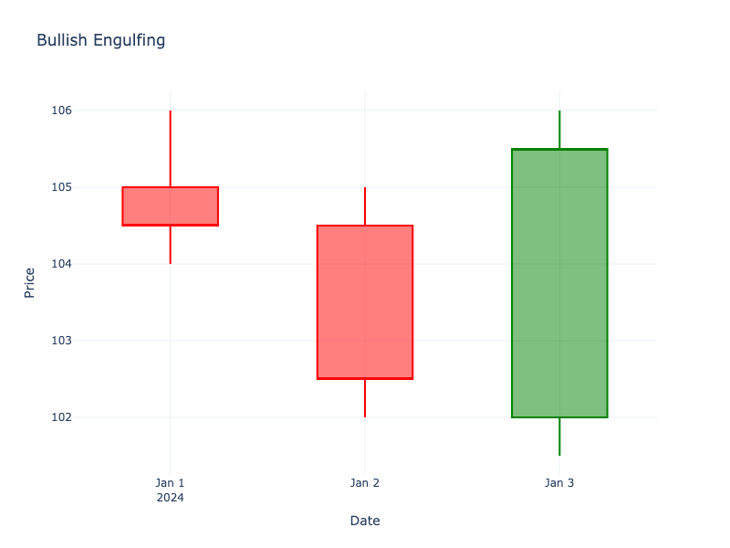

# Bullish Engulfing

| Name | Type | Prerequisite | Use Cases |
| :--- | :--- | :--- | :--- |
| Bullish Engulfing | Bullish Reversal | OHLC Data | Spotting trend reversals to the upside. |

## Definition

A Bullish Engulfing pattern occurs when a small red candlestick is followed by a large green candlestick that completely engulfs the real body of the previous red candle. This pattern typically appears at the bottom of a downtrend.

## Pattern Structure

-   **Candle 1**: Small red (bearish) body.
-   **Candle 2**: Large green (bullish) body that opens lower than Candle 1's close and closes higher than Candle 1's open.

## Mathematical Representation

$$
Open_2 < Close_1 \text{ and } Close_2 > Open_1
$$

## Visualization

## Trading Significance

1.  **Overwhelming Buying Pressure**: The large green candle signifies that buyers have taken control from sellers.
2.  **Strong Reversal**: One of the more powerful reversal signals, especially at support levels.
