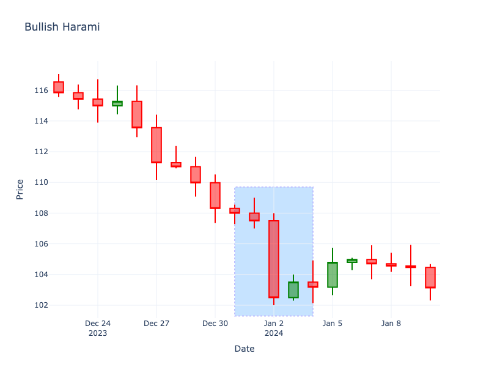

# Bullish Harami

| Name | Type | Prerequisite | Use Cases |
| :--- | :--- | :--- | :--- |
| Bullish Harami | Bullish Reversal | OHLC Data | Indicating a potential reversal or pause in a downtrend. |

## Definition

The Bullish Harami consists of a large red candle followed by a smaller green candle whose body is completely contained within the vertical range of the previous red candle's body. "Harami" implies "pregnant" in Japanese.

## Pattern Structure

1.  **Candle 1**: Long red candle.
2.  **Candle 2**: Small green candle contained entirely within the body of Candle 1.

## Mathematical Representation

$$
Open_1 > Close_2 \text{ and } Close_1 < Open_2
$$

## Visualization

## Story

A vicious downtrend seems fully entrenched after strings of aggressive selling. But unexpectedly, the following session opens higher than the previous close and trades in a tight, subdued range, completely contained within the prior massive red body. This sudden cessation of downward momentum is like a car slamming on its brakes. The bears have suddenly run out of ammunition, giving the battered bulls a glimmer of hope that the tide is turning.

## Trading Significance

1.  **Momentum Pause**: Indicates that the intense selling pressure of the first candle has subsided.
2.  **Reversal Potential**: While not as strong as an engulfing pattern, it signals that the downtrend may be ending.
