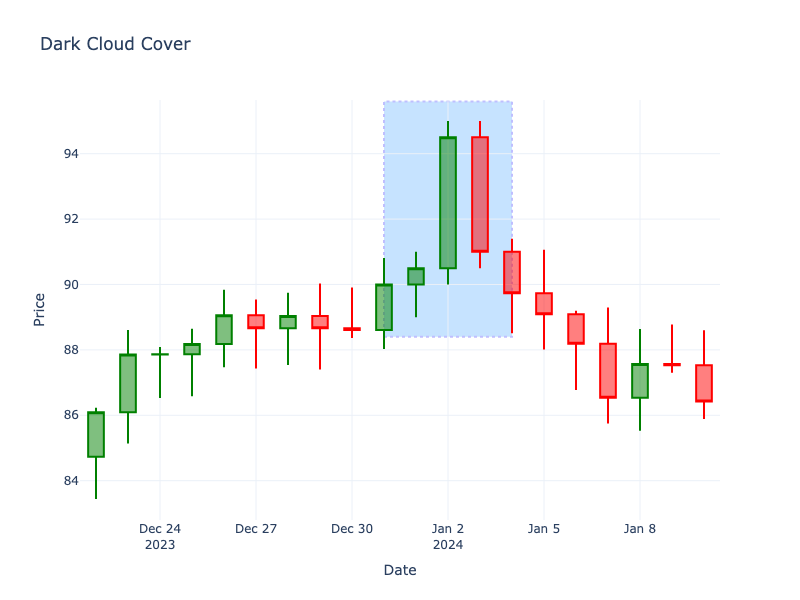

# Dark Cloud Cover

| Name | Type | Prerequisite | Use Cases |
| :--- | :--- | :--- | :--- |
| Dark Cloud Cover | Bearish Reversal | OHLC Data | Signaling a reversal at the top of an uptrend. |

## Definition

The Dark Cloud Cover is the bearish counterpart to the Piercing Line. It consists of a long green candle followed by a long red candle that opens above the previous high but closes more than halfway into the real body of the first candle.

## Pattern Structure

1.  **Candle 1**: Long green candle (uptrend).
2.  **Candle 2**: Long red candle.
    -   Open > High of Candle 1.
    -   Close < Midpoint of Candle 1's Body.

## Visualization

## Story

The bulls push the market to a new high, and the next session opens even higher with a surge of optimism. But the joy is short-lived. A massive wave of selling pressure hits the market like a dark storm cloud. The bears aggressively force the price down, cutting deep into the previous day's gains and closing below its midpoint. This sudden, violent rejection of higher prices traps late buyers and casts a heavy shadow over the uptrend.

## Trading Significance

1.  **Bearish Takeover**: The gap up opening is rejected, and sellers push price deep into the previous day's gains.
2.  **Resistance**: Often marks a resistance level.
