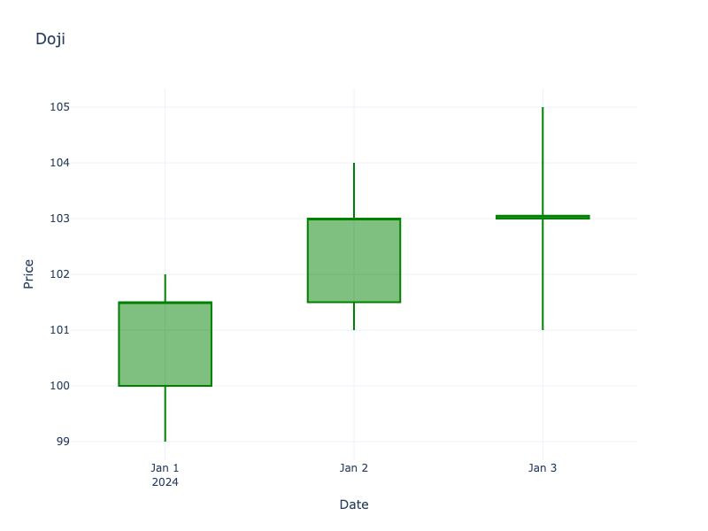

# Doji

| Name | Type | Prerequisite | Use Cases |
| :--- | :--- | :--- | :--- |
| Doji | Reversal / Indecision | OHLC Data | Identifying market indecision and potential reversals. |

## Definition

A Doji is a candlestick pattern that forms when a security's open and close are virtually equal for the given time period. The length of the upper and lower shadows can vary, and the resulting candlestick looks like a cross, inverted cross, or plus sign. A Doji indicates a sense of indecision or neutrality between buyers and sellers.

## Pattern Structure

-   **Open and Close**: Virtually the same.
-   **Shadows**: Can be of varying lengths.

## Mathematical Representation

$$
|Open - Close| \approx 0
$$

## Visualization

## Trading Significance

1.  **Indecision**: Represents a tug-of-war between buyers and sellers where neither side gains control.
2.  **Reversal Signal**: Often signals a reversal after a prolonged trend (uptrend or downtrend).
3.  **Support/Resistance**: Can mark key support or resistance levels.
