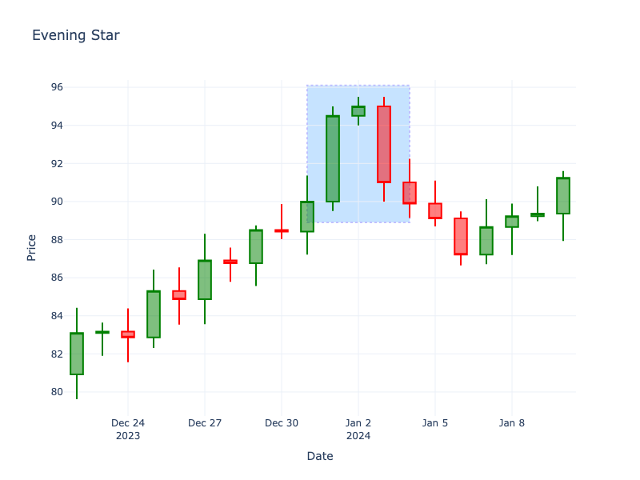

# Evening Star

| Name | Type | Prerequisite | Use Cases |
| :--- | :--- | :--- | :--- |
| Evening Star | Bearish Reversal | OHLC Data | Signaling a bearish reversal at the top of an uptrend. |

## Definition

The Evening Star is a three-candlestick pattern that indicates a bearish reversal. It is the bearish counterpart to the Morning Star. It forms at the top of an uptrend and signifies that the buying momentum is fading and sellers are taking control.

## Pattern Structure

1.  **Candle 1**: Long green candle (uptrend continuation).
2.  **Candle 2**: Small body (red or green) that gaps up from Candle 1. Resembles a star.
3.  **Candle 3**: Long red candle that gaps down from Candle 2 and closes below the midpoint of Candle 1.

## Visualization

## Story

The bulls have pushed the market to a triumphant high with a strong green candle. Overextended, the next session gaps up but stalls out completely, forming a small, anxious candle of indecision at the literal peak of the mountain. Sensing exhaustion, the bears strike on the third session, aggressively driving the price down and locking in a massive red candle. The sun has set on the uptrend, and the buyers realize their momentum is entirely broken.

## Trading Significance

1.  **Trend Change**: The gap up to the second candle shows remaining buying pressure, but the small range indicates loss of momentum.
2.  **Bearish Takeover**: The third candle confirms that sellers have overpowered buyers.
