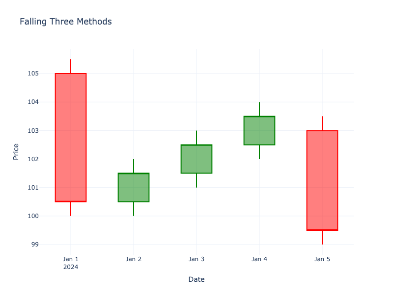

# Falling Three Methods

| Name | Type | Prerequisite | Use Cases |
| :--- | :--- | :--- | :--- |
| Falling Three Methods | Bearish Continuation | OHLC Data | Confirming trend continuation. |

## Definition

A bearish continuation pattern. A long red candle is followed by three small green candles (contained within the first candle's range), and then a fifth long red candle that breaks below the first candle's low.

## Pattern Structure

1.  **Candle 1**: Long red.
2.  **Candles 2-4**: Small, mostly green, consolidated within Candle 1's range.
3.  **Candle 5**: Long red, closes below Candle 1's close.

## Visualization

## Trading Significance

1.  **Brief Pause**: Sellers take a rest, but buyers can't push price up significantly.
2.  **Trend Resumption**: The final candle confirms the downtrend is resuming with strength.
