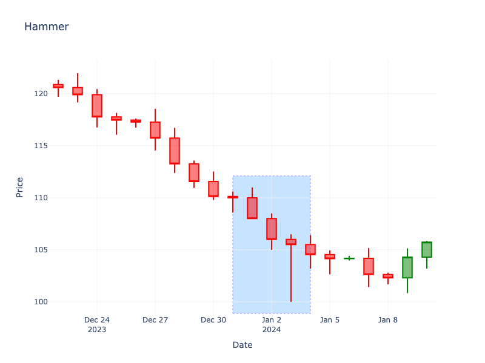

# Hammer

| Name | Type | Prerequisite | Use Cases |
| :--- | :--- | :--- | :--- |
| Hammer | Bullish Reversal | OHLC Data | Identifying potential bottoms in a downtrend. |

## Definition

The Hammer is a bullish reversal pattern that forms during a downtrend. It is characterized by a small real body at the top of the trading range and a long lower shadow. The lower shadow should be at least twice the length of the real body.

## Pattern Structure

-   **Body**: Small, located at the upper end of the trading range. Can be green or red, but green is more bullish.
-   **Lower Shadow**: Long, at least 2x the body length.
-   **Upper Shadow**: Little to none.

## Mathematical Representation

$$
LowerShadow \ge 2 \times |Open - Close|
$$

## Visualization

## Story

The bears come out swinging, aggressively driving the price down and creating panic among the longs. But just when capitulation seems imminent, a surge of buying activity emerges from the shadows. The bulls step in with massive volume, rejecting the lower prices and pushing the market all the way back up to close near the open. It's a dramatic comeback story that leaves the sellers exhausted and the buyers suddenly back in control.

## Trading Significance

1.  **Rejection of Lows**: Shows that sellers pushed prices down, but buyers were able to overcome this selling pressure and close near the open.
2.  **Potential Reversal**: Suggests a transition from bearish to bullish sentiment.
3.  **Confirmation Required**: Ideally confirmed by a subsequent green candle closing higher.
