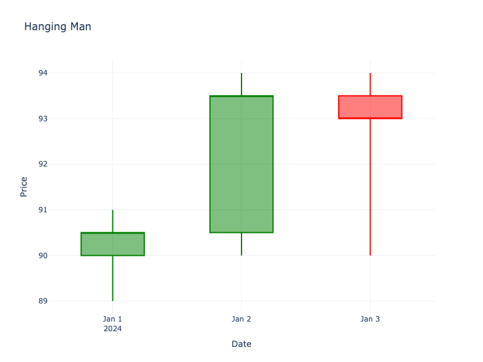

# Hanging Man

| Name | Type | Prerequisite | Use Cases |
| :--- | :--- | :--- | :--- |
| Hanging Man | Bearish Reversal | OHLC Data | Signaling a potential top. |

## Definition

The Hanging Man looks exactly like a Hammer but forms at the top of an uptrend. It has a small real body at the upper end of the trading range and a long lower shadow.

## Pattern Structure

-   **Context**: Forms in an uptrend.
-   **Lower Shadow**: Long, at least 2x body.
-   **Upper Shadow**: Little to none.
-   **Body**: Small (green or red, though red is more bearish).

## Visualization

## Trading Significance

1.  **Vulnerability**: The long lower shadow shows that sellers were able to push the price down significantly during the session.
2.  **Warning Sign**: Even though it closed near the high, the selling pressure is a warning that bulls are losing control.
