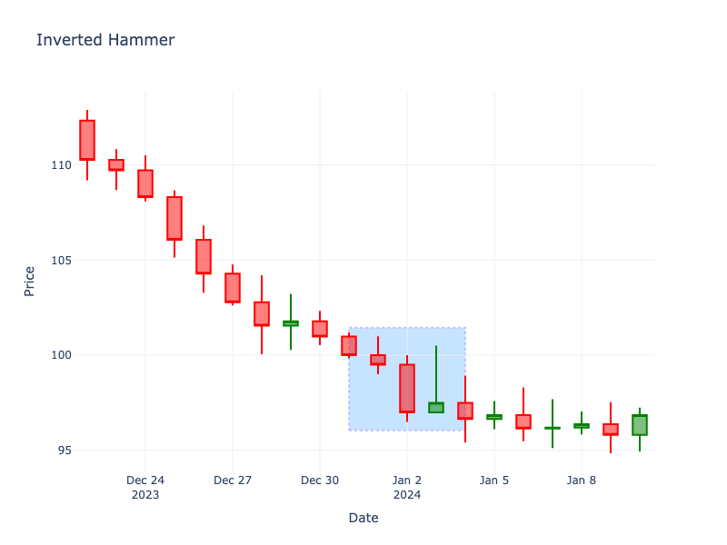

# Inverted Hammer

| Name | Type | Prerequisite | Use Cases |
| :--- | :--- | :--- | :--- |
| Inverted Hammer | Bullish Reversal | OHLC Data | Signaling a potential bottom. |

## Definition

The Inverted Hammer looks exactly like a Shooting Star but forms at the bottom of a downtrend. It has a small body at the lower end of the range and a long upper shadow.

## Pattern Structure

-   **Context**: Forms in a downtrend.
-   **Upper Shadow**: Long, at least 2x body.
-   **Lower Shadow**: Little to none.
-   **Body**: Small (green or red).

## Visualization

## Story

Following a prolonged decline, buyers attempt a daring breakout, pushing the price violently upwards during the session. However, the legacy sellers quickly wake up, slamming the price back down to close near the open. While it looks like a failure on the surface, the very fact that buyers were able to mount such a massive intra-day offensive shows that the bearish grip is finally loosening, planting the seeds for a reversal.

## Trading Significance

1.  **Testing Higher Prices**: Buyers pushed price up significantly during the session, even though it closed near the open.
2.  **Stopping Action**: The failure to make a new low indicates sellers are losing momentum.
