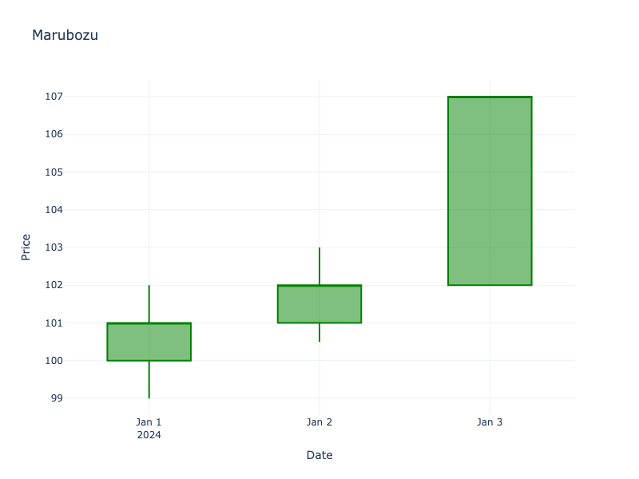

# Marubozu

| Name | Type | Prerequisite | Use Cases |
| :--- | :--- | :--- | :--- |
| Marubozu | Trend Continuation | OHLC Data | identifying strong directional conviction. |

## Definition

A Marubozu is a long candlestick with little to no shadows. It indicates that the opening price was the low (or high) of the day and the closing price was the high (or low) of the day.

## Pattern Structure

-   **Bullish Marubozu**: Open = Low, Close = High. Long green body.
-   **Bearish Marubozu**: Open = High, Close = Low. Long red body.

## Mathematical Representation

$$
High \approx Close \text{ and } Low \approx Open \text{ (Bullish)}
$$
$$
High \approx Open \text{ and } Low \approx Close \text{ (Bearish)}
$$

## Visualization

## Trading Significance

1.  **Strong Conviction**: A White/Green Marubozu indicates intense buying pressure. A Black/Red Marubozu indicates intense selling pressure.
2.  **Continuation**: Often signals the start of a trend or continuation of an existing one.
