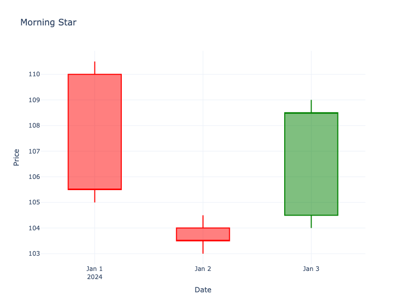

# Morning Star

| Name | Type | Prerequisite | Use Cases |
| :--- | :--- | :--- | :--- |
| Morning Star | Bullish Reversal | OHLC Data | Signaling a bullish reversal at the bottom of a downtrend. |

## Definition

The Morning Star is a three-candlestick pattern that indicates a bullish reversal. It consists of a long bearish candle, a small-bodied candle (open and close are close together) that gaps down, and a third long bullish candle that gaps up and closes well into the body of the first candle.

## Pattern Structure

1.  **Candle 1**: Long red candle (downtrend continuation).
2.  **Candle 2**: Small body (red or green) that gaps down from Candle 1. Ideally a Doji or Spinning Top.
3.  **Candle 3**: Long green candle that gaps up from Candle 2 and closes above the midpoint of Candle 1.

## Visualization

## Trading Significance

1.  **Exhaustion**: The middle candle represents market indecision and seller exhaustion.
2.  **Reversal Confirmation**: The third candle confirms the return of buyers.
3.  **Strong Signal**: Considered a very strong bullish reversal signal.
