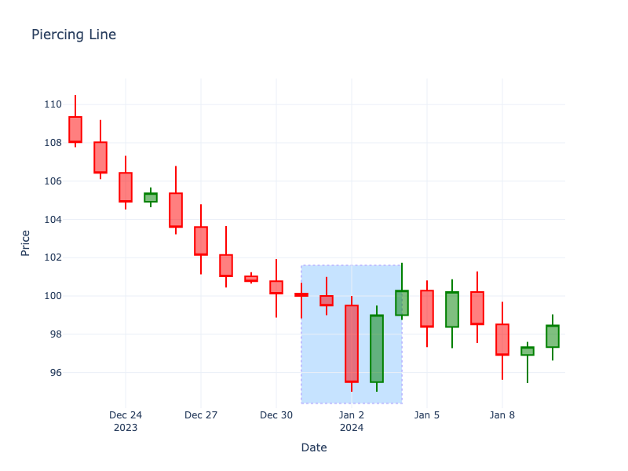

# Piercing Line

| Name | Type | Prerequisite | Use Cases |
| :--- | :--- | :--- | :--- |
| Piercing Line | Bullish Reversal | OHLC Data | Signaling a reversal at the bottom of a downtrend. |

## Definition

The Piercing Line is a two-candle bullish reversal pattern. The first candle is a long red candle. The second is a long green candle that opens lower than the previous low but closes more than halfway up the real body of the first candle.

## Pattern Structure

1.  **Candle 1**: Long red candle (downtrend).
2.  **Candle 2**: Long green candle.
    -   Open < Low of Candle 1.
    -   Close > Midpoint of Candle 1's Body.

## Visualization

## Story

The bears seem victorious, pushing the market down with a strong red candle. The next session opens even lower, confirming the panic. But suddenly, the selling dries up. Deep-pocketed buyers step in at these discount levels, systematically eating through the ask. They push the price higher and higher, eventually closing the session more than halfway up the previous day's red body. It's a powerful statement that the bears have overextended themselves.

## Trading Significance

1.  **Rejection of Lows**: The gap down opening suggests bears are still in control, but the strong close indicates bulls have taken over.
2.  **Confirmation**: Ideally confirmed by a subsequent green candle.
