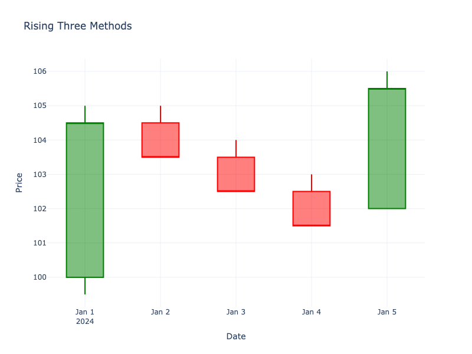

# Rising Three Methods

| Name | Type | Prerequisite | Use Cases |
| :--- | :--- | :--- | :--- |
| Rising Three Methods | Bullish Continuation | OHLC Data | Confirming trend continuation. |

## Definition

A bullish continuation pattern. A long green candle is followed by three small red candles (contained within the first candle's range), and then a fifth long green candle that breaks above the first candle's high.

## Pattern Structure

1.  **Candle 1**: Long green.
2.  **Candles 2-4**: Small, mostly red, consolidated within Candle 1's range.
3.  **Candle 5**: Long green, closes above Candle 1's close.

## Visualization

## Trading Significance

1.  **Brief Pause**: Buyers take a rest, but sellers can't push price down significantly.
2.  **Trend Resumption**: The final candle confirms the uptrend is resuming with strength.
