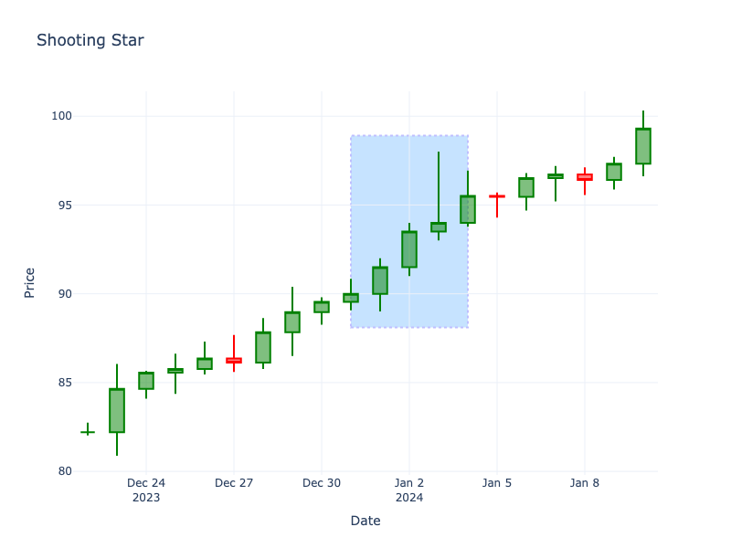

# Shooting Star

| Name | Type | Prerequisite | Use Cases |
| :--- | :--- | :--- | :--- |
| Shooting Star | Bearish Reversal | OHLC Data | Identifying potential tops in an uptrend. |

## Definition

The Shooting Star is a bearish reversal pattern that forms during an uptrend. It usually opens with a gap up, trades significantly higher during the day, but closes near the open. It has a small real body at the lower end of the range and a long upper shadow.

## Pattern Structure

-   **Body**: Small, located at the lower end of the trading range.
-   **Upper Shadow**: Long, at least 2x the body length.
-   **Lower Shadow**: Little to none.

## Mathematical Representation

$$
UpperShadow \ge 2 \times |Open - Close|
$$

## Visualization

## Story

Riding the wave of an uptrend, the bulls push prices to new euphoric heights, seemingly unstoppable. However, at the peak of the session, they hit a solid wall of selling pressure. The bears aggressively step in, taking profits and initiating short positions, completely reversing the intraday gains. The market closes weakly near its opening, leaving behind a long upper wick—a stark monument to the buyers' failed advance.

## Trading Significance

1.  **Rejection of Highs**: Shows that buyers pushed prices up, but sellers overwhelmed them to push the price back down.
2.  **Bearish Signal**: Indicates potential exhaustion of the uptrend.
3.  **Confirmation**: Look for a gap down or a long red candle following the shooting star.
