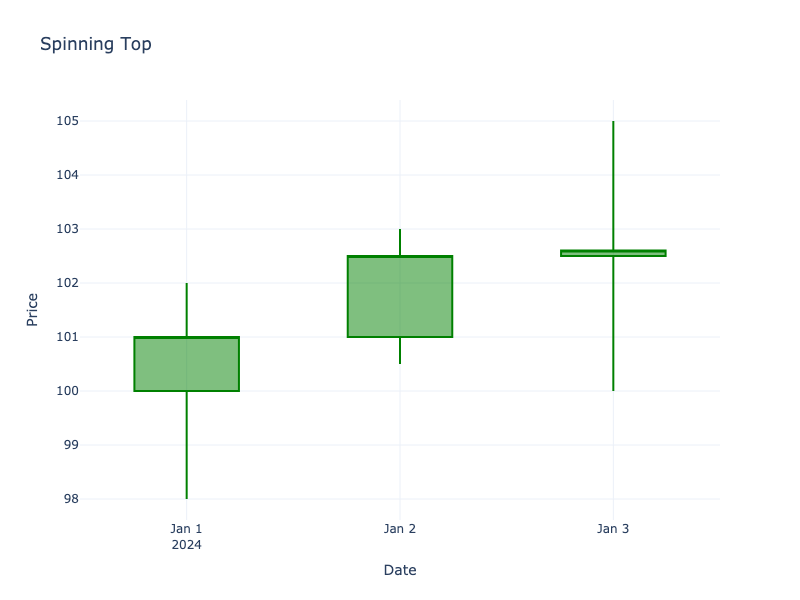

# Spinning Top

| Name | Type | Prerequisite | Use Cases |
| :--- | :--- | :--- | :--- |
| Spinning Top | Indecision | OHLC Data | Identifying market consolidation. |

## Definition

A candlestick with a short real body centered between long upper and lower shadows. The shadows are of roughly equal length.

## Pattern Structure

-   **Body**: Small, centered.
-   **Shadows**: Long upper and lower shadows.

## Visualization

## Trading Significance

1.  **Indecision**: Total neutrality; neither buyers nor sellers could gain the upper hand.
2.  **Consolidation**: Often forms during periods of rest or consolidation within a trend.
