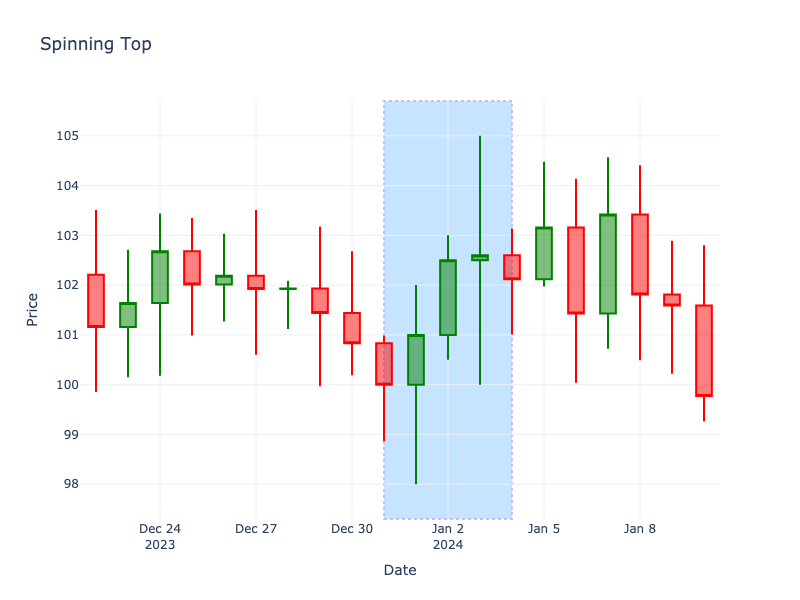

# Spinning Top

| Name | Type | Prerequisite | Use Cases |
| :--- | :--- | :--- | :--- |
| Spinning Top | Indecision | OHLC Data | Identifying market consolidation. |

## Definition

A candlestick with a short real body centered between long upper and lower shadows. The shadows are of roughly equal length.

## Pattern Structure

-   **Body**: Small, centered.
-   **Shadows**: Long upper and lower shadows.

## Visualization

## Story

The market opens, and a fierce tug-of-war ensues. The bulls push it high, the bears drag it low, but by the end of the session, the price settles almost exactly where it started, leaving a tiny body sandwiched between long wicks. It is a visual representation of a complete stalemate. The sheer amount of volatility ending in zero net movement indicates that the current trend is utterly exhausted and deeply confused about its next move.

## Trading Significance

1.  **Indecision**: Total neutrality; neither buyers nor sellers could gain the upper hand.
2.  **Consolidation**: Often forms during periods of rest or consolidation within a trend.
