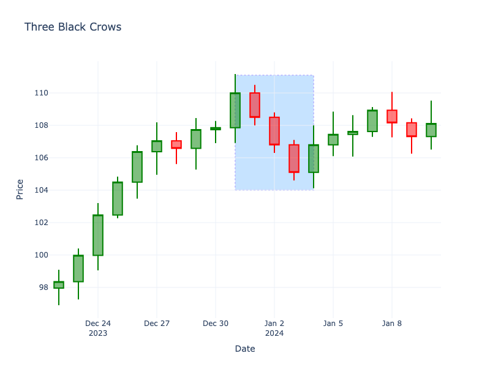

# Three Black Crows

| Name | Type | Prerequisite | Use Cases |
| :--- | :--- | :--- | :--- |
| Three Black Crows | Bearish Reversal | OHLC Data | Confirming a reversal from an uptrend. |

## Definition

The bearish counterpart to Three White Soldiers. It consists of three consecutive long red candles with small wicks, each opening within the previous candle's body and closing lower than the previous close.

## Pattern Structure

1.  **Three Red Candles**: Consecutive.
2.  **Progressive Closes**: Each closes lower than the last.
3.  **Opens**: Each opens within the previous body.
4.  **Shadows**: Small or non-existent.

## Visualization

## Story

The market reaches a peak, but the momentum quickly sours. For three consecutive sessions, the bears systematically dismantle the uptrend. Each day opens slightly higher, giving false hope, before closing near its absolute low with a strong red body. It is a slow, agonizing bleed out that traps optimistic buyers and confirms that a punishing, sustained downtrend has officially begun.

## Trading Significance

1.  **Strong Momentum**: Indicates a decisive shift in sentiment from bullish to bearish.
2.  **Steady Decline**: Shows distinct and consistent selling pressure.
