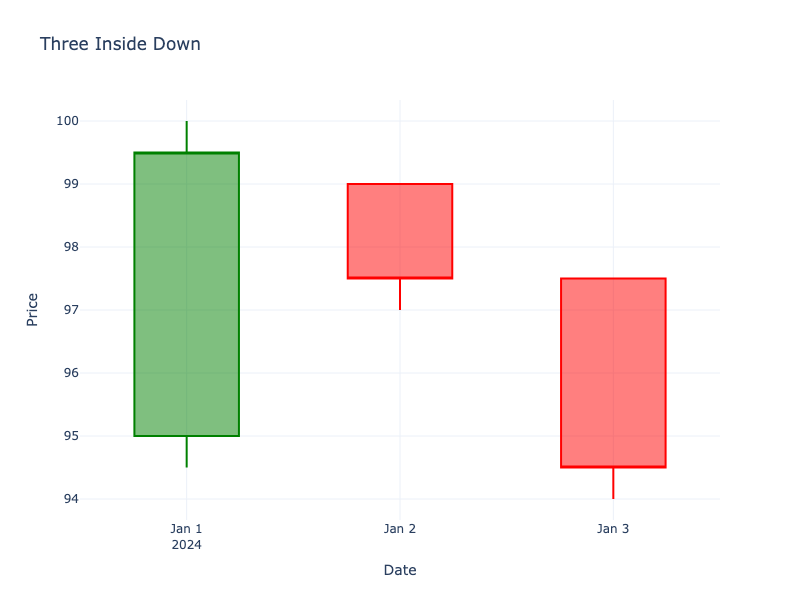

# Three Inside Down

| Name | Type | Prerequisite | Use Cases |
| :--- | :--- | :--- | :--- |
| Three Inside Down | Bearish Reversal | OHLC Data | Confirmed reversal signal. |

## Definition

This is essentially a **Bearish Harami** followed by a confirmation candle.

## Pattern Structure

1.  **Candle 1**: Long green candle.
2.  **Candle 2**: Small red candle inside Candle 1 (Harami).
3.  **Candle 3**: Red candle closing below Candle 2's close (Confirmation).

## Visualization

## Trading Significance

1.  **Confirmation**: The third candle provides the confirmation that the Harami reversal is valid.
2.  **Higher Confidence**: More reliable than a simple Harami.
