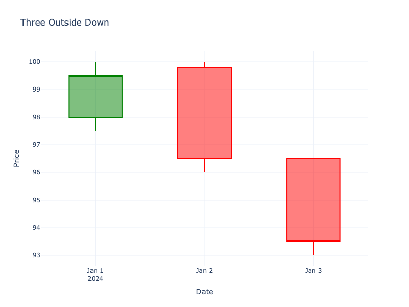

# Three Outside Down

| Name | Type | Prerequisite | Use Cases |
| :--- | :--- | :--- | :--- |
| Three Outside Down | Bearish Reversal | OHLC Data | Confirmed reversal signal. |

## Definition

This is essentially a **Bearish Engulfing** pattern followed by a confirmation candle.

## Pattern Structure

1.  **Candle 1**: Small green candle.
2.  **Candle 2**: Large red candle engulfing Candle 1 (Engulfing).
3.  **Candle 3**: Red candle closing below Candle 2's close (Confirmation).

## Visualization

## Trading Significance

1.  **Strong Reversal**: The engulfing pattern already shows strength, and the third candle confirms it.
2.  **Sustained Momentum**: Indicates sellers are maintaining control.
