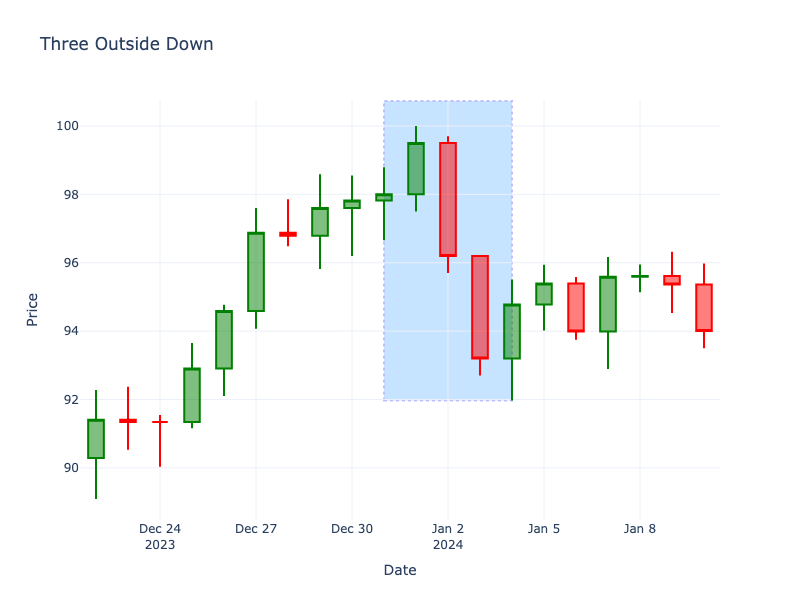

# Three Outside Down

| Name | Type | Prerequisite | Use Cases |
| :--- | :--- | :--- | :--- |
| Three Outside Down | Bearish Reversal | OHLC Data | Confirmed reversal signal. |

## Definition

This is essentially a **Bearish Engulfing** pattern followed by a confirmation candle.

## Pattern Structure

1.  **Candle 1**: Small green candle.
2.  **Candle 2**: Large red candle engulfing Candle 1 (Engulfing).
3.  **Candle 3**: Red candle closing below Candle 2's close (Confirmation).

## Visualization

## Story

Buyers cautiously advance with a small green candle, but they walk straight into an ambush. The next day, a massive red candle violently engulfs all previous gains. The bears follow up on the third day with another punishing descent to lock in the losses and trap all long positions. It is a merciless, escalating attack that permanently shatters the bullish sentiment and dictates a new downward trajectory.

## Trading Significance

1.  **Strong Reversal**: The engulfing pattern already shows strength, and the third candle confirms it.
2.  **Sustained Momentum**: Indicates sellers are maintaining control.
