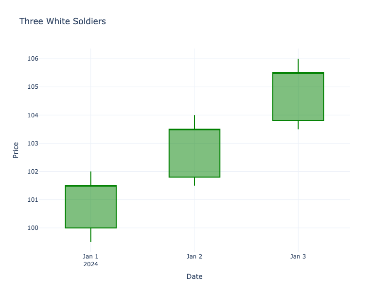

# Three White Soldiers

| Name | Type | Prerequisite | Use Cases |
| :--- | :--- | :--- | :--- |
| Three White Soldiers | Bullish Reversal | OHLC Data | Confirming a reversal from a downtrend. |

## Definition

This pattern consists of three consecutive long green candles with small wicks, each opening within the previous candle's body and closing higher than the previous close.

## Pattern Structure

1.  **Three Green Candles**: Consecutive.
2.  **Progressive Closes**: Each closes higher than the last.
3.  **Opens**: Each opens within the previous body.
4.  **Shadows**: Small or non-existent.

## Visualization

## Trading Significance

1.  **Strong Momentum**: Indicates a decisive shift in sentiment from bearish to bullish.
2.  **Steady Advance**: Shows a steady and strong influx of buying pressure.
