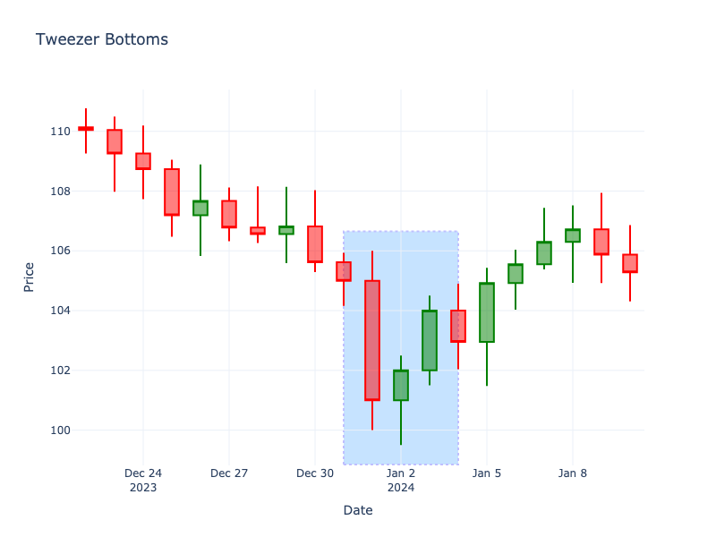

# Tweezer Bottoms

| Name | Type | Prerequisite | Use Cases |
| :--- | :--- | :--- | :--- |
| Tweezer Bottoms | Bullish Reversal | OHLC Data | Identifying support levels. |

## Definition

Tweezer Bottoms form when two or more candlesticks have the same (or very similar) low price. They indicate a firm support level that sellers cannot push below.

## Pattern Structure

-   **Context**: Downtrend.
-   **Candle 1**: Usually a long red candle.
-   **Candle 2**: Retests the exact low of Candle 1.

## Visualization

## Story

The bears drive the price down, establishing a distinct, hard floor. In the following session, they attempt to break this support level again, but are met with a literal brick wall from the buyers at the exact same price point. This repeated, precise rejection at a specific bottom creates a 'tweezer' shape, signaling to the market that an unbreakable line in the sand has been drawn by the bulls.

## Trading Significance

1.  **Support Confirmation**: The market tested the same low twice and failed to break it.
2.  **Double Bottom**: Can be seen as a mini double bottom pattern.
