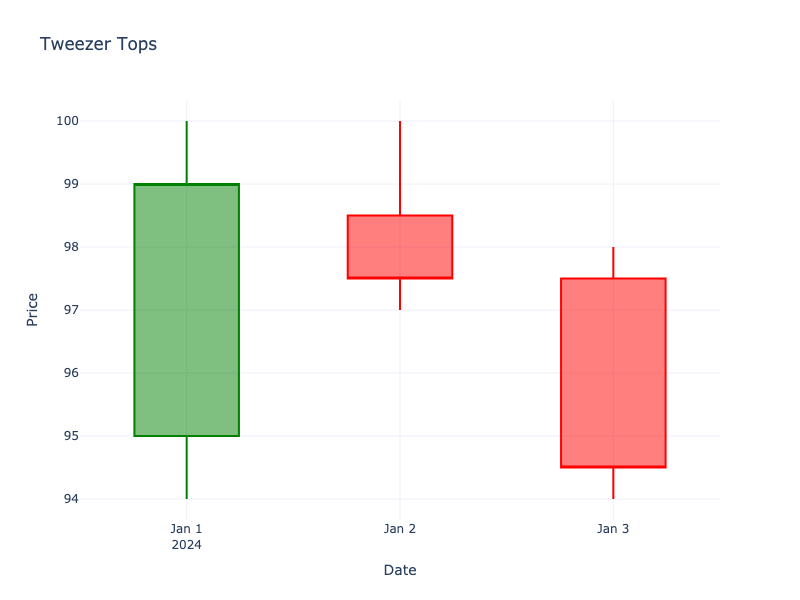

# Tweezer Tops

| Name | Type | Prerequisite | Use Cases |
| :--- | :--- | :--- | :--- |
| Tweezer Tops | Bearish Reversal | OHLC Data | Identifying resistance levels. |

## Definition

Tweezer Tops form when two or more candlesticks have the same (or very similar) high price. They indicate a firm resistance level that buyers cannot push above.

## Pattern Structure

-   **Context**: Uptrend.
-   **Candle 1**: Usually a long green candle.
-   **Candle 2**: Retests the exact high of Candle 1.

## Visualization

## Trading Significance

1.  **Resistance Confirmation**: The market tested the same high twice and failed to break it.
2.  **Double Top**: Can be seen as a mini double top pattern.
